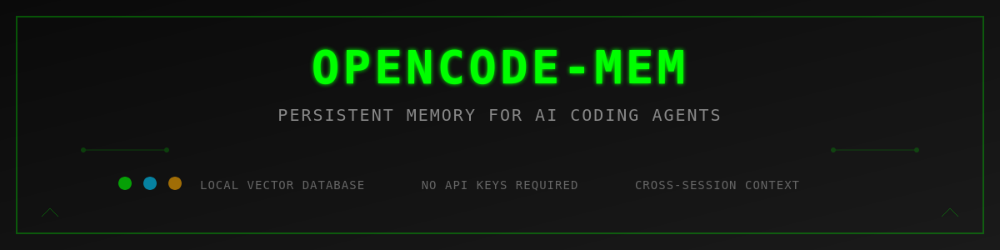

# OpenCode Memory



A persistent memory system for AI coding agents that enables long-term context retention across sessions using local vector database technology.

## Overview

OpenCode Memory is a plugin for OpenCode that provides AI coding agents with the ability to remember and recall information across conversations. It uses vector embeddings and SQLite for efficient storage and retrieval of contextual information, enabling agents to maintain continuity in complex, multi-session projects.

## Key Features

- **Local Vector Database**: SQLite-based storage with sqlite-vec extension for efficient similarity search
- **Dual Memory Scopes**: Separate user-level and project-level memory contexts
- **Web Interface**: Full-featured UI for memory management, search, and maintenance
- **Auto-Capture System**: Intelligent background memory extraction from conversations
- **Flexible Embedding Models**: Support for 12+ local models or OpenAI-compatible APIs
- **Automatic Sharding**: Scales to millions of vectors with automatic shard management
- **Smart Deduplication**: Prevents redundant memories using similarity detection
- **Privacy Protection**: Built-in content filtering for sensitive information
- **Zero Configuration**: Works out of the box with sensible defaults

## Installation

### Prerequisites

- OpenCode AI platform

### Install Plugin

Add the plugin to your OpenCode configuration file:

**Location**: `~/.config/opencode/opencode.json` or `opencode.jsonc`

```jsonc
{
  "plugins": [
    "opencode-mem"
  ]
}
```

OpenCode will automatically download and install the plugin on next startup.

### Install from Source (Development)

For development or contributing:

```bash
git clone https://github.com/tickernelz/opencode-mem.git
cd opencode-mem
bun install
bun run build
```

Then add the local path to your OpenCode config:

```jsonc
{
  "plugins": [
    "/path/to/opencode-mem"
  ]
}
```

## Quick Start

### Basic Usage

Once installed, the memory tool is automatically available in your OpenCode environment:

```typescript
memory({ mode: "add", content: "User prefers TypeScript over JavaScript", scope: "user" })
memory({ mode: "search", query: "coding preferences", scope: "user" })
memory({ mode: "profile" })
memory({ mode: "list", scope: "project", limit: 10 })
```

### Web Interface

Access the web interface at `http://127.0.0.1:4747` (default) to:

- Browse and search all memories
- Edit, delete, or pin important memories
- Run maintenance operations (cleanup, deduplication)
- View statistics and analytics
- Manage memory scopes and tags

### Configuration

Configuration file is automatically created at `~/.config/opencode/opencode-mem.jsonc`:

```jsonc
{
  "storagePath": "~/.opencode-mem/data",
  "embeddingModel": "Xenova/nomic-embed-text-v1",
  "webServerEnabled": true,
  "webServerPort": 4747,
  "webServerHost": "127.0.0.1",
  "similarityThreshold": 0.6,
  "maxMemories": 5,
  "maxProjectMemories": 10,
  "autoCleanupEnabled": true,
  "autoCleanupRetentionDays": 30,
  "deduplicationEnabled": true,
  "autoCaptureEnabled": true
}
```

## Memory Operations

### Add Memory

Store information with scope and optional metadata:

```typescript
memory({
  mode: "add",
  content: "Project uses React 18 with TypeScript and Vite",
  scope: "project",
  type: "architecture"
})
```

### Search Memory

Vector similarity search across stored memories:

```typescript
memory({
  mode: "search",
  query: "What framework does this project use?",
  scope: "project"
})
```

### View Profile

Display user profile with preferences and patterns:

```typescript
memory({ mode: "profile" })
```

### List Memories

Retrieve recent memories by scope:

```typescript
memory({ mode: "list", scope: "user", limit: 20 })
```

### Forget Memory

Delete specific memory by ID:

```typescript
memory({ mode: "forget", memoryId: "mem_abc123" })
```

### Auto-Capture Control

Manage automatic memory capture:

```typescript
memory({ mode: "auto-capture-toggle" })
memory({ mode: "auto-capture-stats" })
memory({ mode: "capture-now" })
```

## Memory Scopes

### User Scope

Cross-project information about user preferences, behaviors, and patterns:

- Coding style preferences
- Tool and framework preferences
- Communication style
- Work patterns and habits
- General technical knowledge

### Project Scope

Project-specific knowledge and context:

- Architecture decisions
- Technology stack
- Code patterns and conventions
- Bug fixes and solutions
- Feature implementations
- Configuration details

## Auto-Capture System

The auto-capture system automatically extracts important information from conversations using AI:

### Configuration

```jsonc
{
  "autoCaptureEnabled": true,
  "memoryModel": "gpt-4",
  "memoryApiUrl": "https://api.openai.com/v1",
  "memoryApiKey": "sk-...",
  "autoCaptureTokenThreshold": 10000,
  "autoCaptureMinTokens": 20000,
  "autoCaptureMaxMemories": 10,
  "autoCaptureContextWindow": 3
}
```

### How It Works

1. Monitors conversation token count
2. Triggers when threshold is reached
3. Analyzes recent messages using AI
4. Extracts relevant information
5. Stores memories with appropriate scope
6. Runs in background without blocking

## Embedding Models

### Local Models (Default)

Runs entirely on your machine without external API calls:

- `Xenova/nomic-embed-text-v1` (768 dimensions, default)
- `Xenova/all-MiniLM-L6-v2` (384 dimensions)
- `Xenova/all-mpnet-base-v2` (768 dimensions)
- `Xenova/bge-small-en-v1.5` (384 dimensions)
- `Xenova/bge-base-en-v1.5` (768 dimensions)
- And more...

### API-Based Models

Use OpenAI-compatible APIs for embeddings:

```jsonc
{
  "embeddingApiUrl": "https://api.openai.com/v1",
  "embeddingApiKey": "sk-...",
  "embeddingModel": "text-embedding-3-small"
}
```

## Database Architecture

### Automatic Sharding

- Default shard size: 50,000 vectors
- Automatic shard creation and management
- Efficient cross-shard search
- Scales to millions of vectors

### Vector Search

- Cosine similarity algorithm
- Configurable similarity threshold
- Fast approximate nearest neighbor search
- Metadata filtering support

### Maintenance Operations

**Cleanup**: Remove old memories based on retention period

```typescript
POST /api/cleanup
{ "retentionDays": 30, "dryRun": false }
```

**Deduplication**: Remove similar duplicate memories

```typescript
POST /api/deduplicate
{ "similarityThreshold": 0.9, "dryRun": false }
```

**Migration**: Change embedding model dimensions

```typescript
POST /api/migrate
{ "newModel": "Xenova/all-MiniLM-L6-v2", "newDimensions": 384 }
```

## Web Interface Features

### Memory Explorer

- Full-text and vector search
- Filter by scope, type, and tags
- Sort by date, relevance, or pinned status
- Bulk operations (delete, export)
- Pagination for large datasets

### Memory Editor

- Edit content and metadata
- Change scope and type
- Add or remove tags
- Pin important memories
- Delete individual memories

### Maintenance Dashboard

- Run cleanup operations
- Execute deduplication
- Perform model migrations
- View operation results
- Dry-run mode for safety

### Statistics

- Total memory count by scope
- Storage usage metrics
- Auto-capture statistics
- Search performance metrics

## Configuration Reference

### Storage Settings

| Option | Type | Default | Description |
|--------|------|---------|-------------|
| `storagePath` | string | `~/.opencode-mem/data` | Database storage location |
| `maxVectorsPerShard` | number | `50000` | Vectors per shard before splitting |

### Embedding Settings

| Option | Type | Default | Description |
|--------|------|---------|-------------|
| `embeddingModel` | string | `Xenova/nomic-embed-text-v1` | Model name for embeddings |
| `embeddingDimensions` | number | auto | Vector dimensions (auto-detected) |
| `embeddingApiUrl` | string | - | Optional external API endpoint |
| `embeddingApiKey` | string | - | API key for external service |

### Web Server Settings

| Option | Type | Default | Description |
|--------|------|---------|-------------|
| `webServerEnabled` | boolean | `true` | Enable web interface |
| `webServerPort` | number | `4747` | HTTP server port |
| `webServerHost` | string | `127.0.0.1` | Bind address |

### Search Settings

| Option | Type | Default | Description |
|--------|------|---------|-------------|
| `similarityThreshold` | number | `0.6` | Minimum similarity for search results |
| `maxMemories` | number | `5` | Max user memories to inject |
| `maxProjectMemories` | number | `10` | Max project memories to inject |

### Auto-Capture Settings

| Option | Type | Default | Description |
|--------|------|---------|-------------|
| `autoCaptureEnabled` | boolean | `true` | Enable auto-capture |
| `memoryModel` | string | - | AI model for capture (required) |
| `memoryApiUrl` | string | - | API endpoint (required) |
| `memoryApiKey` | string | - | API key (required) |
| `autoCaptureTokenThreshold` | number | `10000` | Token count trigger |
| `autoCaptureMinTokens` | number | `20000` | Minimum tokens before capture |
| `autoCaptureMaxMemories` | number | `10` | Max memories per capture |
| `autoCaptureContextWindow` | number | `3` | Message history to analyze |

### Maintenance Settings

| Option | Type | Default | Description |
|--------|------|---------|-------------|
| `autoCleanupEnabled` | boolean | `true` | Enable automatic cleanup |
| `autoCleanupRetentionDays` | number | `30` | Days to retain memories |
| `deduplicationEnabled` | boolean | `true` | Enable deduplication |
| `deduplicationSimilarityThreshold` | number | `0.9` | Similarity threshold for duplicates |

### Advanced Settings

| Option | Type | Default | Description |
|--------|------|---------|-------------|
| `injectProfile` | boolean | `true` | Inject user profile in context |
| `keywordPatterns` | string[] | `[]` | Custom keyword regex patterns |
| `containerTagPrefix` | string | `opencode` | Tag prefix for containers |
| `maxProfileItems` | number | `5` | Max items in profile summary |

## API Reference

### REST Endpoints

**GET /api/memories**
- Query parameters: `scope`, `type`, `tag`, `search`, `limit`, `offset`
- Returns: Array of memory objects with metadata

**POST /api/memories**
- Body: `{ content, scope, type, metadata }`
- Returns: Created memory object with ID

**PUT /api/memories/:id**
- Body: `{ content, scope, type, metadata, pinned }`
- Returns: Updated memory object

**DELETE /api/memories/:id**
- Returns: Success confirmation

**POST /api/search**
- Body: `{ query, scope, limit, threshold }`
- Returns: Array of similar memories with scores

**GET /api/stats**
- Returns: Database statistics and counts

**POST /api/cleanup**
- Body: `{ retentionDays, dryRun }`
- Returns: Cleanup results

**POST /api/deduplicate**
- Body: `{ similarityThreshold, dryRun }`
- Returns: Deduplication results

**POST /api/migrate**
- Body: `{ newModel, newDimensions }`
- Returns: Migration progress and results

## Privacy and Security

### Content Filtering

Automatically strips sensitive patterns:

- API keys and tokens
- Passwords and credentials
- Private keys and certificates
- Email addresses
- Phone numbers
- Credit card numbers

### Private Content Detection

Prevents storing fully private content:

- Checks for high density of sensitive patterns
- Warns user when private content is detected
- Allows manual override if needed

### Local-First Architecture

- All data stored locally on your machine
- No external services required (except optional API embeddings)
- Full control over your data
- No telemetry or tracking

## Troubleshooting

### Web Interface Not Accessible

Check if the server is running:

```bash
curl http://127.0.0.1:4747/api/stats
```

Verify configuration:

```jsonc
{
  "webServerEnabled": true,
  "webServerPort": 4747,
  "webServerHost": "127.0.0.1"
}
```

### Slow Search Performance

- Reduce `maxMemories` and `maxProjectMemories`
- Increase `similarityThreshold` to filter more results
- Run deduplication to reduce database size
- Consider using smaller embedding model

### High Memory Usage

- Enable auto-cleanup with shorter retention
- Run manual cleanup operations
- Reduce `maxVectorsPerShard` for smaller shards
- Use smaller embedding model (384 vs 768 dimensions)

### Auto-Capture Not Working

Verify configuration:

```jsonc
{
  "autoCaptureEnabled": true,
  "memoryModel": "gpt-4",
  "memoryApiUrl": "https://api.openai.com/v1",
  "memoryApiKey": "sk-..."
}
```

Check API key and endpoint are valid.

## Development

### Build from Source

```bash
git clone https://github.com/tickernelz/opencode-mem.git
cd opencode-mem
bun install
bun run build
```

### Development Mode

```bash
bun run dev
```

### Code Formatting

```bash
bun run format
bun run format:check
```

### Type Checking

```bash
bun run typecheck
```

## Architecture

### Core Components

- **Memory Client**: Main interface for memory operations
- **Embedding Service**: Vector generation (local or API)
- **Shard Manager**: Automatic database sharding
- **Vector Search**: Similarity search implementation
- **Web Server**: HTTP API and static file serving
- **Auto-Capture**: Background memory extraction
- **Cleanup Service**: Retention-based deletion
- **Deduplication Service**: Duplicate detection
- **Migration Service**: Model dimension changes

### Data Flow

```
User Input → Plugin Hook → Memory Client → Embedding Service → SQLite Vector DB
                ↓                                                      ↓
         Keyword Detection                                    Shard Manager
                ↓                                                      ↓
         Memory Nudge                                      Vector Search
                ↓                                                      ↓
         Tool Execution ← API Handlers ← Web Server ← Web Interface
```

### Plugin Integration

- **Hooks**: `chat.message`, `event`
- **Tools**: `memory` tool with 9 modes
- **Context Injection**: Automatic memory injection in conversations
- **Keyword Detection**: 16 default patterns for memory triggers

## Contributing

Contributions are welcome. Please ensure:

- Code follows existing style (Prettier configuration)
- TypeScript strict mode compliance
- No breaking changes to public API
- Tests pass (when available)
- Documentation updated

## License

MIT License - see LICENSE file for details

## Acknowledgments

This project was inspired by and references [opencode-supermemory](https://github.com/supermemoryai/opencode-supermemory) as the primary reference implementation.

## Links

- **Repository**: https://github.com/tickernelz/opencode-mem
- **Issues**: https://github.com/tickernelz/opencode-mem/issues
- **OpenCode Platform**: https://opencode.ai

## Support

For issues, questions, or feature requests, please open an issue on GitHub.
