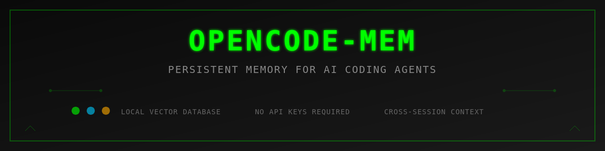

# OpenCode Memory

[](https://www.npmjs.com/package/opencode-mem)
[](https://www.npmjs.com/package/opencode-mem)
[](https://www.npmjs.com/package/opencode-mem)



A persistent memory system for AI coding agents that enables long-term context retention across sessions using local vector database technology.

## Visual Overview

**Project Memory Timeline:**


**User Profile Viewer:**


## Core Features

Local vector database with SQLite + USearch-first vector indexing and ExactScan fallback, persistent project memories, automatic user profile learning, unified memory-prompt timeline, full-featured web UI, intelligent prompt-based memory extraction, multi-provider AI support (OpenAI, Anthropic), 12+ local embedding models, smart deduplication, and built-in privacy protection.

## Prerequisites

This plugin uses `USearch` for preferred in-memory vector indexing with automatic ExactScan fallback. No custom SQLite build or browser runtime shim is required.

**Recommended runtime:**

- Bun
- Standard OpenCode plugin environment

**Notes:**

- If `USearch` is unavailable or fails at runtime, the plugin automatically falls back to exact vector scanning.
- SQLite remains the source of truth; search indexes are rebuilt from SQLite data when needed.

## Getting Started

Add to your OpenCode configuration at `~/.config/opencode/opencode.json`:

```jsonc
{
  "plugin": ["opencode-mem"],
}
```

The plugin downloads automatically on next startup.

## Usage Examples

```typescript
memory({ mode: "add", content: "Project uses microservices architecture" });
memory({ mode: "search", query: "architecture decisions" });
memory({ mode: "search", query: "architecture decisions", scope: "all-projects" });
memory({ mode: "profile" });
memory({ mode: "list", limit: 10 });
```

Access the web interface at `http://127.0.0.1:4747` for visual memory browsing and management.

## Configuration Essentials

Configure at `~/.config/opencode/opencode-mem.jsonc`:

```jsonc
{
  "storagePath": "~/.opencode-mem/data",
  "userEmailOverride": "user@example.com",
  "userNameOverride": "John Doe",
  "embeddingModel": "Xenova/nomic-embed-text-v1",
  "memory": {
    "defaultScope": "project",
  },
  "webServerEnabled": true,
  "webServerPort": 4747,

  "autoCaptureEnabled": true,
  "autoCaptureLanguage": "auto",

  "opencodeProvider": "anthropic",
  "opencodeModel": "claude-haiku-4-5-20251001",

  "showAutoCaptureToasts": true,
  "showUserProfileToasts": true,
  "showErrorToasts": true,

  "userProfileAnalysisInterval": 10,
  "maxMemories": 10,

  "compaction": {
    "enabled": true,
    "memoryLimit": 10,
  },
  "chatMessage": {
    "enabled": true,
    "maxMemories": 3,
    "excludeCurrentSession": true,
    "maxAgeDays": undefined,
    "injectOn": "first",
  },
}
```

### Memory Scope

- `scope: "project"`: query only the current project. This is the default.
- `scope: "all-projects"`: query `search` / `list` across all project shards.
- `memory.defaultScope` sets the default query scope when no explicit scope is provided.

### Auto-Capture AI Provider

**Recommended:** Use opencode's built-in providers (no separate API key needed):

```jsonc
"opencodeProvider": "anthropic",
"opencodeModel": "claude-haiku-4-5-20251001",
```

This leverages your existing opencode authentication (OAuth or API key). Works with Claude Pro/Max plans via OAuth - no individual API keys required.

Supported providers: `anthropic`, `openai`

**Fallback:** Manual API configuration (if not using opencodeProvider):

```jsonc
"memoryProvider": "openai-chat",
"memoryModel": "gpt-4o-mini",
"memoryApiUrl": "https://api.openai.com/v1",
"memoryApiKey": "sk-...",
```

**API Key Formats:**

```jsonc
"memoryApiKey": "sk-..."
"memoryApiKey": "file://~/.config/opencode/api-key.txt"
"memoryApiKey": "env://OPENAI_API_KEY"
```

Full documentation available in this README.

## Development & Contribution

Build and test locally:

```bash
bun install
bun run build
bun run typecheck
bun run format
```

This project is actively seeking contributions to become the definitive memory plugin for AI coding agents. Whether you are fixing bugs, adding features, improving documentation, or expanding embedding model support, your contributions are critical. The codebase is well-structured and ready for enhancement. If you hit a blocker or have improvement ideas, submit a pull request - we review and merge contributions quickly.

## License & Links

MIT License - see LICENSE file

- **Repository**: https://github.com/tickernelz/opencode-mem
- **Issues**: https://github.com/tickernelz/opencode-mem/issues
- **OpenCode Platform**: https://opencode.ai

Inspired by [opencode-supermemory](https://github.com/supermemoryai/opencode-supermemory)
